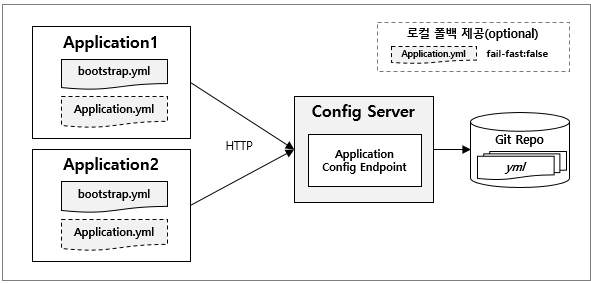
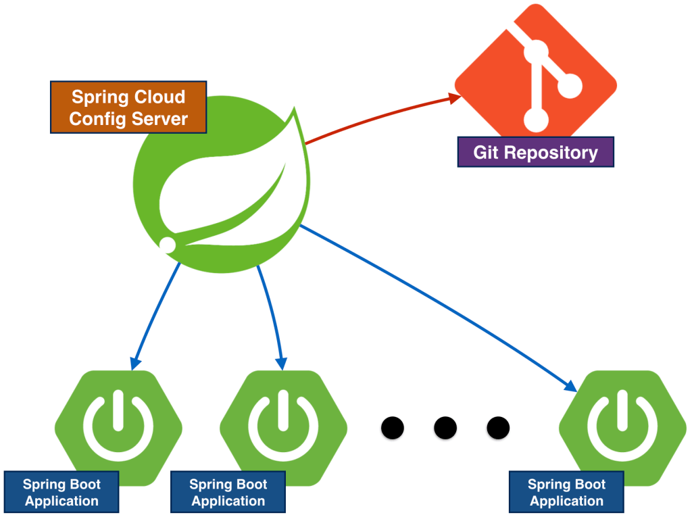

Spring Cloud config-server & client
===
설정 파일의 외부화
--
The Twelve-Factor App(https://12factor.net)은 클라우드 환경에 적합한 애플리케이션의 특성을 12가지 원칙으로 정리한 방법론으로, 클라우드 플랫폼 창시자들이 정립한 애플리케이션 개발 원칙 중 유익한 것을 모아서 정리한 것이다. 이 중에서 설정에 관한 원칙이 있는데, 애플리케이션의 환경설정 정보를 코드로부터 분리하여 외부화하는 것을 하나의 원칙으로 제시하고 있다. 이는 환경에 따라 달라지는 설정 정보를 소스로부터 분리하여 둘 간의 결합도를 낮추고, 유지보수성을 좋게 만들자는 원칙이다. 이런 관점에서 가장 최악의 선택은 설정정보를 소스 코드 내의 상수로 관리하는 것이다.
***


설정 정보를 소스코드에서 분리시키기
--
일반적으로 설정 정보는 소스코드와 분리된 별도의 파일로 관리한다. Spring Boot 기반으로 볼 때, application.properties 또는 application.yml 파일에 설정 정보를 관리하는데 이 방식도 설정 파일이 프로젝트에 포함된 경우라면, 설정 정보의 변경이 필요할 경우 애플리케이션 전체를 다시 빌드하고 배포해야 하는 종속성 문제가 생긴다. 
***


설정 정보를 배포 패키지에서 분리시키기
--
설정 정보 파일을 애플리케이션 배포 패키지에서 분리시키기 위한 몇 가지 방법이 존재하기는 하다. 

```
자바 기반 프로젝트로 보면, 
1) 애플리케이션 실행 시, 설정 정보 파일 위치를 옵션에 명시
2) @PropertySource Annotation으로 설정정보 파일 위치를 명시
3) 시스템 자체의 환경설정 정보를 읽어오는 System.getProperties() 사용하기
```

*하지만, 위 방법들도 설정 정보의 변경이 발생하면 애플리케이션을 중지했다가 다시 구동해야 하는 종속성 문제가 발생한다.
***


설정 정보를 원격 서버에서 제공하기
--
따라서, 위와 같은 문제들을 해결하기 위해 Spring Cloud에서는 Spring Cloud Config Server를 활용하여 원격지 서버에서 설정 정보를 서비스할 수 있게 해준다. 쉽게 말하자면, 환경별(local, dev, stg, prd)로 작성된 설정 파일(*.properties, *.yml 등)들을 Git에 올려놓고, 해당 Git에 올라가있는 설정 파일들을 읽어서 다른 애플리케이션이 요청했을 때 설정 파일 데이터를 JSON 형태의 응답으로 제공해주는 Spring Cloud Config Server를 구동시켜주기만 하면, 이 설정 파일의 정보를 이용하고자 하는 애플리케이션이 구동 시점에 Spring Cloud Config Server에 HTTP로 설정 정보를 요청하고, 이에 대한 응답으로 설정 정보를 받아와서 설정을 할 수 있게 되는 것이다.


또한, Spring Cloud Config Server는 이러한 설정 정보를 애플리케이션을 재구동할 필요 없이 간단하게 동적으로 변경하고 실시간으로 반영할 수 있게 해준다. (Git에 있는 properties나 yml을 변경하고 Push한 다음 Refresh하면 재구동 없이 반영된다.)



* 이미지 출처 : <https://m.mkexdev.net/414>



* 이미지 출처 : <http://blog.leekyoungil.com/?p=352>
***


Config 서버의 가용성
==
Config 서버가 1대 뿐이라면 SPOF(single point of failure, 단일장애지점)가 된다. SPOF는 라이브환경에서는 언제나 재앙의 대상이 되곤 한다. 하지만 Config 서버의 구동방식을 보면 일반적인 SPOF에 비해 그 부담이 다소 적다.
***
**1. 운영중 가용성**
--
Config 서버와 연동하는 클라이언트는 최초 구동 시에만 서버에서 HTTP로 설정값을 읽어온다. 이후부터는 클라이언트 측에 로컬 캐시되어 더이상 Config 서버와 통신하지 않는다. 다만, 설정 정보가 갱신될 경우 구동되고 있는 클라이언트 측에 ‘/actuator/refresh’ POST 요청을 전송하면 서버에서 새로운 값을 다시 읽어 오도록 하는데, 이때도 서버가 응답이 없다면 기존 로컬 캐시값을 사용한다. 즉, Config 서버가 다운되었다고 하더라도 클라이언트들은 다운되거나 하지 않는다는 말이다. (단 서버의 변경 값을 동기화하지 못할 경우, 일관성 문제는 생길 수 있다)
***


**2. 최초 구동시 가용성**
--
클라이언트가 최초 구동되는 시점에 Config 서버가 다운된 상황이라면, 클라이언트를 구동할 수도, 구동이 안되게 할 수도 있다. 그 방법은 fail-fast 값을 true 혹은 false(기본값)로 설정하는 것이다. fail-fast 값이 true로 설정되면, Config 서버와 연결하지 못했을 때 클라이언트는 구동하지 않게 된다. false라면, Config 서버가 다운된 상황에서도 Client 프로그램은 구동되도록 하는 것이다. (물론 이렇게 되면 Config 서버로부터 설정정보를 받아오지 못하는 문제가 생긴다.) 이를 대비해서 클라이언트에서는 동일한 설정 정보를 자신의 설정파일에 갖고 있게할 수도 있다. 이렇게 되면 Config 서버와 연결이 실패하더라도 클라이언트는 동일한 설정을 자신의 설정 파일로부터 읽어들일 수 있다. (이 조치는 최소한의 가용성 확보를 위한 전략)
***


설정 정보의 실시간 동기화
--
Config 서버의 설정정보가 변경되면 이를 의존 하고 있는 클라이언트 프로그램들에게 알려줘야 한다. 이 때 사용되는 것이 @RefreshScope Annotation과 ‘/actuator/refresh’ POST 요청이다. 이 두 작업은 클라이언트 측에서 수행되어야 하는데 실시간 동기화가 필요한 곳, 즉 설정 정보를 엑세스 하는 클래스에 @RefreshScope 어노테이션을 붙여 주면 된다. 그리고 클라이언트의 주소에 /actuator/refresh POST (Body는 빈 값으로) 요청을 전송하면 클라이언트 로컬에 캐시된 설정 정보를 Config 서버에서 가져온 값으로 즉시 갱신한다.

그러나 Config 서버에 의존하는 클라이언트가 상당히 많은 수일 경우, 모든 클라이언트의 /actuator/refresh 요청을 명시적으로 호출해줘야 하기 때문에 유지보수가 까다로워진다. 이에 대한 대안으로 Spring Cloud Bus를 사용하면 메시지 브로커를 통해 변경 이벤트를 구독하여 자동으로 모든 클라이언트에 변경 정보를 자동으로 동기화 할 수 있다.
***


추가 – Spring Boot Actuator, management.endpoints.web.expose.include=“*”
--
Refresh url은 Boot가 2.0 버전으로 올라가면서 {호스트명}/refresh에서 {호스트명}/actuator/refresh로 변경되었다. 기존과 같이 /refresh POST 요청을 보낼 경우에는 404가 발생한다. 또한, 현재 버전에서는 management.endpoints.web.expose.include=“*” 도 application.yml 혹은 bootstrap.yml에 기재해줘야 한다. 

여기서, management.endpoints.web.expose.include=“*”는 Spring Boot 2.x에서 Actuator를 이용할 때, default로 대부분의 정보를 노출하지 않는 것으로 되어있기 때문에 해당 부분을 *로 변경해줘서 모든 정보(*)를 포함하여 노출하겠다고 설정해주는 것이다. 만약, 보안으로 인해 노출하고 싶지 않은 부분은 management.endpoints.web.exposure.exclude=env,beans 과 같이 설정해주면 된다.

또한, exclude 속성은 include 속성보다 우위에 있기 때문에 include로 지정해놓아도, exclude로 지정되어 있으면 정보 노출 대상에서 배제된다. 
***


References
== 
- 개발 이야기 : The Twelve Factor App : <https://m.blog.naver.com/gngh0101/221499996051>
- Spring Cloud Config Server에 관하여 알아봅시다. : <http://blog.leekyoungil.com/?p=352>
- 설정 파일의 외부화(Spring Cloud Config) : <https://m.mkexdev.net/414>